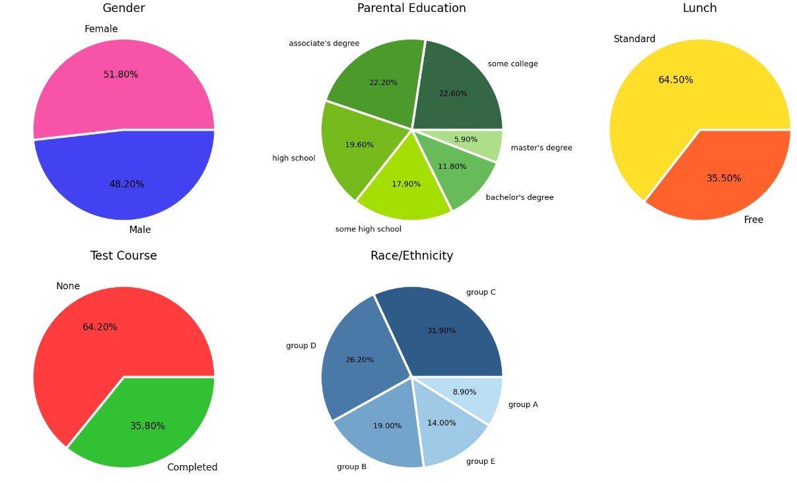
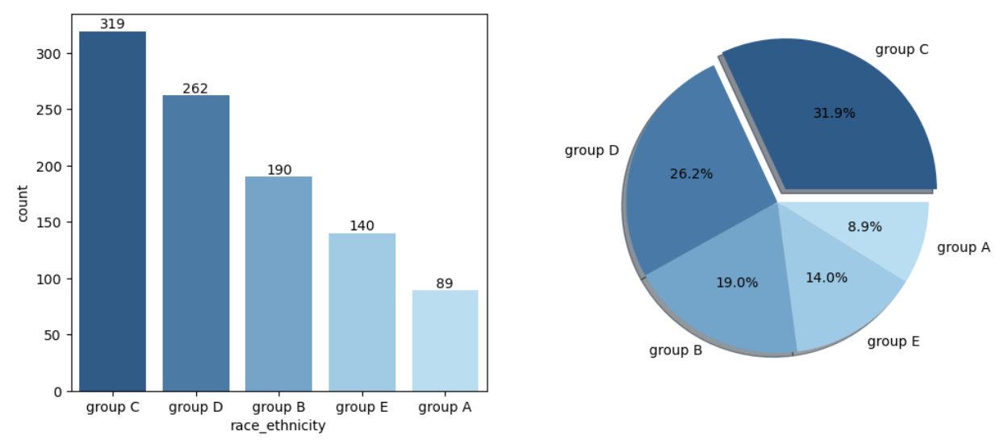
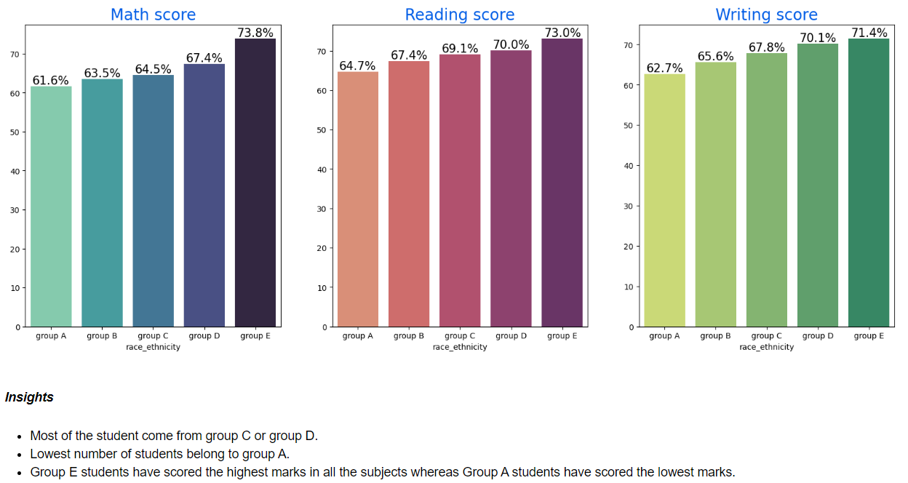
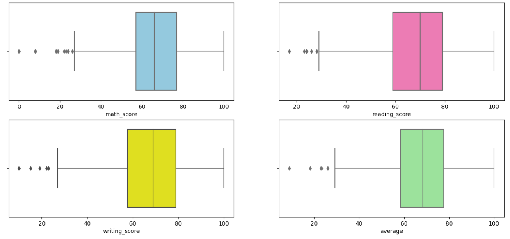
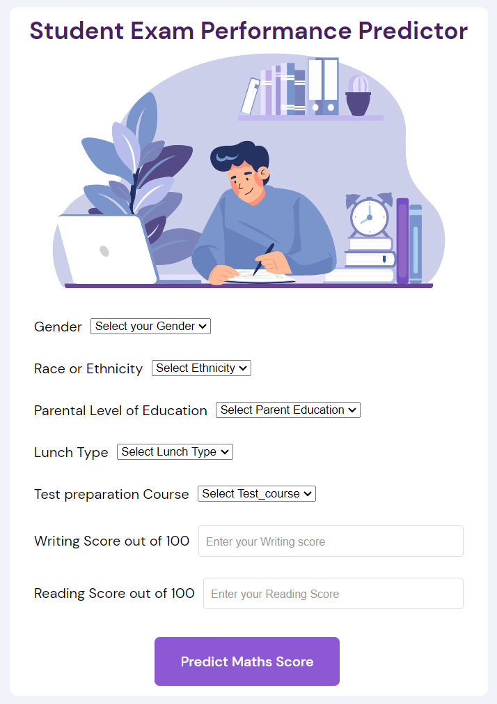
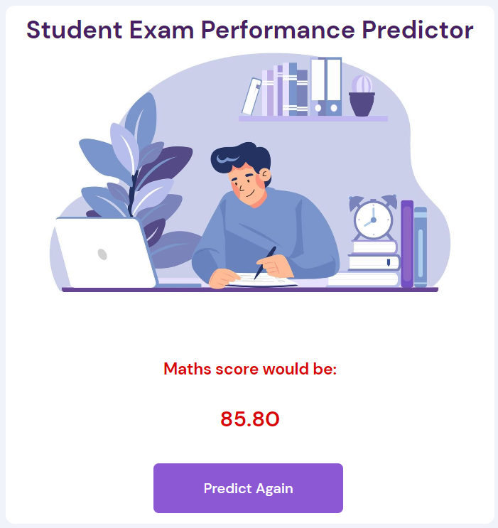

# 🕮 Student Exam Performance Predictor 🕮

Welcome to the "Student Exam Performance Predictor" repository! Here, you will find a comprehensive implementation of the Student Exam Performance dataset, using a web application developed with Flask and Render. Checkout the web application at: [Student Performance Predictor](https://student-performance-prediction-5nms.onrender.com)


This project covers a wide range of functionalities, including exploratory data analysis (EDA), feature engineering, model selection, and an organized pipeline-based approach to data processing.


## 📃Table of contents

1. [Project Structure](#%EF%B8%8F-project-structure)
2. [Data](#-Data)
3. [EDA](#-exploratory-data-analysis-eda) 
4. [Feature Engineering](#-feature-engineering)
5. [Model Selection](#-model-selection)
6. [Flask App on Render](#-flask-app-on-render)
7. [Future work](#-Future-work)
## 🗃️ Project Structure
This explains the project structure and the role of each file or folder.
```
├── artifacts
│   ├── data.csv - The dataset is stored as a dataframe 
│   ├── model.pkl - The best model stored in pickle file
│   ├── preprocessor.pkl - Data transformation in pickle file
│   ├── test.csv - The test set 
│   └── train.csv -  The training set 
│ 
├── notebooks  
│   ├── data
│   │   └── StudentsPerformance.csv - The original dataset
│   │
│   └── EDA_Student_Performance.ipynb - EDA in Jupyter notebook
│
├── src  - This is the source folder which contains all the code.
│   ├── components
│   │   ├── data_ingestion.py - Reading the dataset and spliting into train and test sets
│   │   ├── data_transformation.py - Column transformation with pipelines for both 
                                     numerical and categorical columns. Data 
                                     encoding and normalization is done here.
│   │   └── model_trainer.py - choosing the best model &training the model
│   │
│   ├── pipeline 
│   │   └── predict_pipeline.py - implements the  preprocessor and model pickle 
                                  files and predicts for new data.
│   │
│   ├── exception.py - for custom exception handling 
│   ├── logger.py - for creating logs 
│   └── utils.py - any common functions used across the project
│
├── static
│   └── style.css - styling the app pages
│
├── templates 
│   ├── home.html - home page of app
│   └── prediction.html - page for predicting new scores
│
├── app.py - the flask app file
│ 
├── requirements.txt - all the required packages
│ 
└── setup.py - builds the project as a package
```
##  📊 Data

[](https://github.com/09Darshita09/Student_Performance/blob/main/notebooks/data/StudentsPerformance.csv) 

The Student Exam Performance dataset provides valuable insights into various factors that may affect students' performance in exams. It includes features such as student demographics, parental education, test preparation, and scores in different subjects.


## 📈 Exploratory Data Analysis (EDA)

[](https://github.com/09Darshita09/Student_Performance/blob/main/notebooks/EDA_Student_Performance.ipynb)

The Juypter notebook mentioned above, gives valuable insights into student exam performance by delving into the dataset. The EDA process involves analyzing the dataset to gain a better understanding of its features and their relationships. 

The data is checked for any missing values or duplicates here. All numerical and categorical features are analysed. This step also includes informative visualizations, summary statistics, and data exploration techniques to uncover patterns, correlations, and potential outliers.

The observations of each unique values of every feature.



Feature-wise visualization is also done to analyse :

- the group-wise distribution (univariate analysis)
    
- the impact of each feature on the students' perfmance (bivariate analysis)
    

Many other visual analysis are done and insights about each observation are given, such as:

The plot to check potential outliers:

## ⚙️ Feature Engineering

For the inital version of the project only the maths score is considered as a dependent fetaure and the reading and writing scores are taken as numerical independent features. This can be changed in later versions & is discussed in [Future work](#-Future-work).

A pipeline is created for both numerical and categorical features each. In these pipelines the features are either scaled or encoded based on type & requirements. Then the column transformer is applied using these pipleines and the preprocessor is fit_transform on train set & transform on test set. Then this preprocessor is stored in a pickle file. 
## 🧠 Model Selection 

This project uses GridSearchCV to select the hyperparameters for the following algorithms and selects the best model with highest r2 score:
 - LinearRegression
 - KNeighborsRegressor
 - DecisionTreeRegressor
 - RandomForestRegressor
 - AdaBoostRegressor
 - GradientBoostingRegressor
 - SupportVectorRregressor
 - CatBoostRegressor
 - XGBRegressor

The best model is stored in the log file. The current version of the project has **LinearRegression** as the best model with **88%** r2 score. If the highest r2 score is below 0.6, then none of these is best model. After the selection the best model is stored in model.pkl file.
## 🌐 Flask App on Render

Checkout the web application at: [Student Performance Predictor](https://student-performance-prediction-5nms.onrender.com)

The web application developed in this project allows users to interact with the dataset and gain insights into the factors influencing students' exam performance. The application has a user-friendly interface to input new data into home page and check the prediction on the prediction page.

The web application is developed using a WSGI framework **Flask** in app.py and it is then deployed on **Render**.

**Home page**:



**Prediction page**:


## 🚀 Future work

Currently out of the three exam scores: reading, writing and maths only the maths score is being predicted. In the future versions, even the other two scores can be predicted based on just the categorical features. 
## 🔗 Reach me at:

[](https://www.linkedin.com/in/darshita-pangam/) 

[](https://github.com/09Darshita09) 

[](https://www.kaggle.com/darshitapangam )

[](https://studio.edgeimpulse.com/studio/profile/projects)
